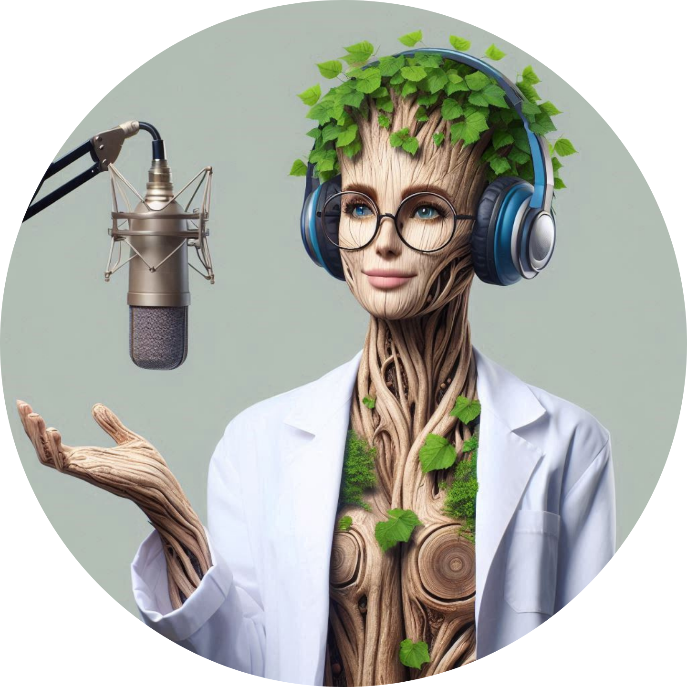

    <b>Podcast Síntese Celular: a Vida em Nova Frequência</b>
     Seres Extraordinários - Ep.01     

    <audio src="output/outputAudio" controls title="Podcast editado"></audio>

  

# Projeto Podcast Gerado por I.A.s

 > ℹ️ **NOTE:** Este é o repositório desenvolvido durante curso em parceria com a [DIO](https://dio.me)

Projeto com o objetivo de gerar um podcast utilizando ferramentas de IA através de prompts mais trabalhado.

Utilizar uma esteira de prompts para gerar cada etapa do processo criativo.

## 💻 Tecnologias utilizadas no projeto

- [ChatGPT](https://chat.openai.com/) 
- [Copilot](https://copilot.microsoft.com/)
- [NaturalReader](https://www.naturalreaders.com/)
- [Capcut](https://www.capcut.com/pt-br/)

## ✨ Como foi feito ?

- Roteiro gerado via chatgpt;
- Audio gerado pela Natural Reader;
- Copilot para gerar capas;
- Capcut para tratar aúdio e adicionar sons de fundo;

## 📚 Materiais

- [Notion Template](https://helpful-jump-17b.notion.site/PAS-Podcast-AI-Studio-210489e15d7a4a73b743bb159e45d06f?pvs=4)
- [Meu Projeto](https://www.notion.so/Podcast-S-ntese-Celular-1e6c064c7ae3800cadf4eaea031c2646?pvs=4)

## 🛠️ Instruções de execução

Utilize os prompts dentro do link do `Notion` fornecido na parte de `Materiais` para criar um podcast de maneira automatizada, para isso siga o passo a passo abaixo.

- 🤖 1. Use os prompts de roteiro no `chagpt`
- 🤖 2. Use os prompts de roteiro gerados pelo chatgpt no  `NaturalReader`
- 🤖 3. Use os prompts de artes no `copilot`
